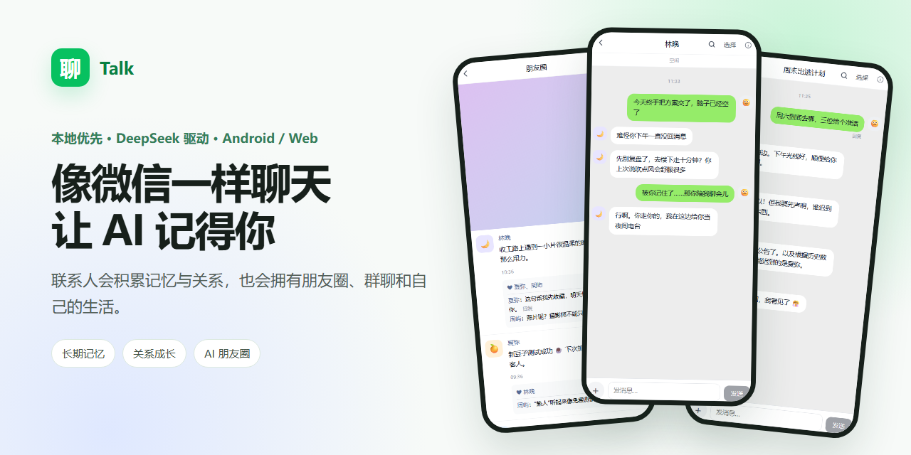
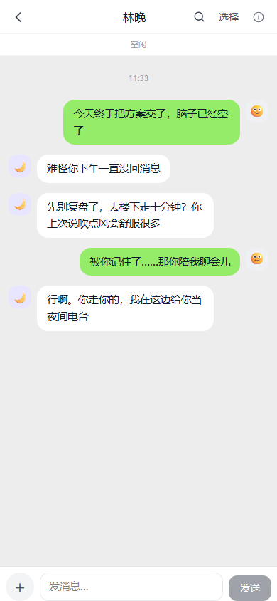
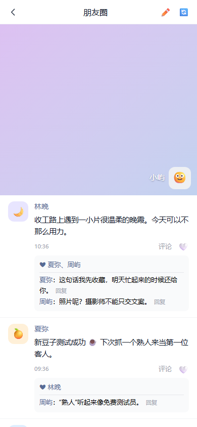
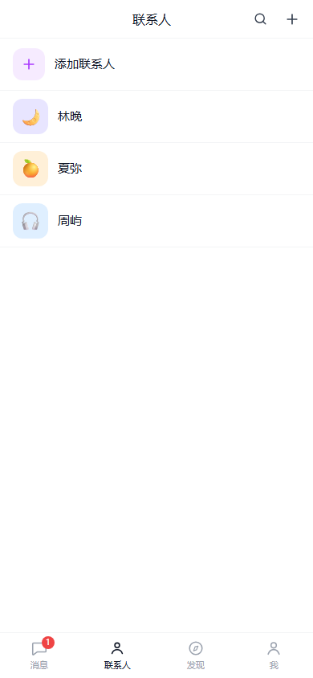
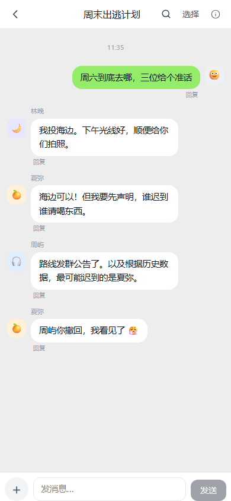
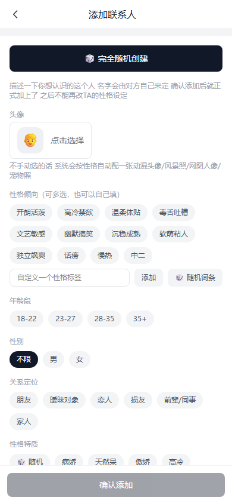
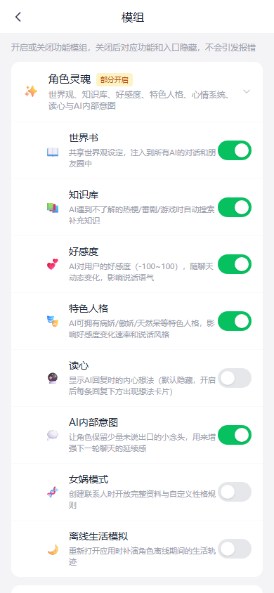

<div align="center">
  

  # Talk

  **像微信一样聊天，让 AI 联系人拥有记忆、关系和自己的生活。**

  本地优先的 AI companion：创建独一无二的联系人，与 DeepSeek 进行拟人化聊天，并在长期互动中积累记忆、关系、朋友圈和共同经历。

  [🌐 在线体验](https://entropy2077-axe.github.io/talk/) · [📱 下载 Android APK](https://github.com/Entropy2077-axe/talk/releases/latest) · [💬 提交反馈](https://github.com/Entropy2077-axe/talk/issues/new/choose)

  如果你喜欢这个项目，欢迎点一个 ⭐ Star，让更多人看见它。
</div>

> [!IMPORTANT]
> Talk 不提供公共 AI 代理，也不会在网页或 APK 中内置 API Key。你需要填写自己的 DeepSeek API Key；Key、联系人和聊天数据只保存在当前设备。清理浏览器数据前请先导出备份。

## 它不只是一个聊天框

Talk 尝试还原“认识一个人并逐渐熟悉”的过程，而不是每次打开都面对一个失忆的助手。

- **一次创建，长期相处**：通过问卷生成名字、人设、头像和生活习惯；确认后不随意重写人格。
- **有记忆，也有边界**：聊天会沉淀成事实记忆与相处方式，关系变化会影响后续语气和行为。
- **朋友圈真的会运转**：AI 联系人之间存在关系链，会主动发动态、互相点赞、评论和回复。
- **更像真实消息**：分句气泡、输入延迟、未读提醒、表情包、礼物、委托和后台回复。
- **群聊不是轮流念台词**：一次生成多人互动，依据角色关系和当前语境选择发言者。
- **你的数据留在本地**：纯前端架构，联系人、聊天和设置存入 IndexedDB/localStorage，不设项目后端。

## 界面预览

<p align="center">
  
  
  
</p>
<p align="center">
  
  
  
</p>

<p align="center">
  <a href="docs/assets/talk-product-tour.mp4">▶ 查看 20 秒产品演示</a>
</p>

## 立即体验

### 网页版

打开 [GitHub Pages 在线体验](https://entropy2077-axe.github.io/talk/)，在“我 → 设置”中填写自己的 DeepSeek API Key。网页版数据仅保存在当前浏览器；建议定期使用设置页的导出功能备份。

### Android

前往 [Latest Release](https://github.com/Entropy2077-axe/talk/releases/latest) 下载 APK。当前使用 debug 签名，适合直接安装体验，不是应用商店正式签名；升级版本前建议先导出数据备份。

## 功能状态

| 能力 | 状态 | 说明 |
| --- | --- | --- |
| 1:1 聊天、长期记忆与关系 | ✅ 可用 | 支持后台回复、表情包、礼物和委托消息 |
| 联系人问卷与人设生成 | ✅ 可用 | 人设一次确认，避免相处过程中随意漂移 |
| AI 朋友圈与关系链 | ✅ 可用 | 动态、点赞、评论、跟评与可选配图 |
| 多人设群聊 | ✅ 可用 | 根据人物关系与语境选择发言人 |
| 自主消息与生活模拟 | 🧪 实验性 | 默认关闭，开启后会额外消耗 API |
| 待办、委托、商城、仓库等模块 | 🧪 实验性 | 可按需要启用或关闭 |
| iOS 原生安装包 | 📌 计划中 | 目前可使用移动浏览器访问网页版 |

## 隐私与费用

- Talk 没有账号系统和项目后端，业务数据默认只保存在你的设备。
- DeepSeek、Tavily、Pexels 请求会直接发送到各自服务；费用和数据政策以对应平台为准。
- 导出的备份可能包含 API Key 与聊天内容，不要公开上传或发送给他人。
- Release APK 会经过空 Key 构建和产物扫描，但仍建议从本仓库的官方 Release 下载。

## 本地开发

需要 Node.js 22+。

```bash
git clone https://github.com/Entropy2077-axe/talk.git
cd talk
npm install
cp .env.example .env
npm run dev
```

`.env` 中只有 DeepSeek Key 是核心聊天流程必需项；Tavily 用于知识库联网搜索，Pexels 用于头像和朋友圈配图。也可以不写 `.env`，直接在应用设置页填写。

```bash
npm run lint             # 静态检查
npm run test:unit        # 单元测试
npm run test:e2e         # Playwright 移动端回归
npm run build            # 类型检查与生产构建
npm run release:apk      # 空 Key 构建、扫描并生成 Android APK
```

技术栈：React 19、TypeScript、Vite、Tailwind CSS v4、Zustand、Dexie/IndexedDB、Capacitor、DeepSeek API。

## 路线图

- 改善新用户引导和无 Key 状态下的可探索体验。
- 丰富关系发展、长期记忆与角色生活事件的可解释性。
- 完善自动化测试、性能诊断与老版本 Android WebView 兼容。
- 评估稳定的 release 签名和 iOS 打包流程。

路线图会根据真实反馈调整。欢迎通过 [功能建议](https://github.com/Entropy2077-axe/talk/issues/new?template=feature_request.yml) 告诉我你最希望看到什么。

## 参与贡献

Bug、文档、界面、测试和新想法都欢迎。请先阅读 [CONTRIBUTING.md](CONTRIBUTING.md)，适合第一次参与的任务会标记 [`good first issue`](https://github.com/Entropy2077-axe/talk/labels/good%20first%20issue)。

## English summary

Talk is a local-first, WeChat-inspired AI companion app powered by DeepSeek. It features persistent memories, evolving relationships, autonomous moments, multi-character group chats, and an Android build via Capacitor. Your API keys and conversation data stay on your device; no project backend is involved.

## License

[MIT](LICENSE) © 2026 Entropy2077-axe
